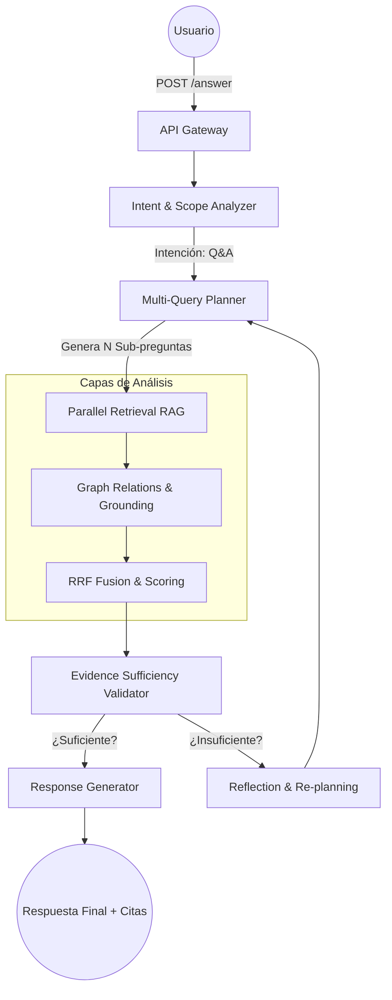

# Orchestrator End-to-End Flow

El Orchestrator actúa como el cerebro del sistema, coordinando múltiples servicios (como el RAG) para responder preguntas complejas que requieren análisis, planificación y síntesis.

## Flujo de Procesamiento de Preguntas

El orquestador utiliza un flujo reactivo basado en **LangGraph** para manejar la incertidumbre y asegurar que la respuesta sea factualmente correcta.

## Componentes Principales

### 1. Intent & Scope Analyzer
Determina si la consulta es una pregunta directa, un análisis de brechas o una solicitud de resumen. También resuelve el "Contexto de Seguridad" (Tenant, Colección y Estándares ISO aplicables).

### 2. Multi-Query Planner
Descompone una pregunta compleja en sub-consultas atómicas. Por ejemplo, "compara A con B" se descompone en "busca A" y "busca B" para ser ejecutadas en paralelo contra el RAG.

### 3. Parallel Retrieval (RAG Interface)
Llama al servicio RAG de forma concurrente. El orquestador espera los resultados de todas las ramas, maneja timeouts y errores parciales, devolviendo un rastro (trace) exhaustivo.

### 4. Evidence Sufficiency Validator
Es la fase de "crítica". Un modelo de lenguaje evalúa si la evidencia recuperada permite responder la pregunta original sin alucinar. Si falta información, puede activar una segunda ronda de búsqueda.

## Flujo de Datos E2E

1.  **Request:** El cliente envía una pregunta y sus credenciales.
2.  **Orquestación:** Se activan los nodos de LangGraph.
3.  **Grounded Knowledge:** Se recuperan chunks y se validan mediante el LeakCanary del RAG.
4.  **Synthesis:** Se genera una respuesta técnica que cita explícitamente los UUIDs de los chunks encontrados.
5.  **Response:** Se devuelve la respuesta junto con un mapa de citas y el plan de recuperación ejecutado.
